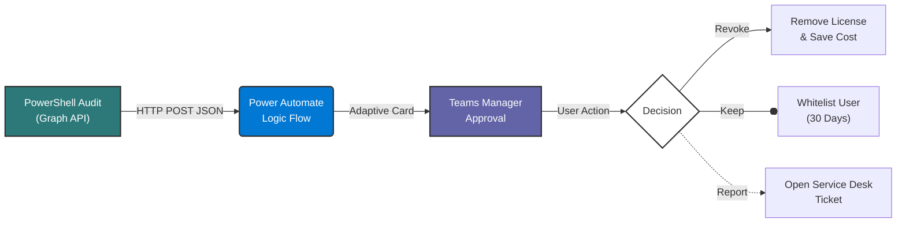

# 🚀 M365 License & Access Optimizer

### 📋 Project Overview
**Automated Governance for Microsoft 365 Licensing**

This project addresses a common challenge in large organizations: **License Sprawl**. It provides an automated workflow to identify inactive users ("zombie accounts"), validate their status with their direct managers via Microsoft Teams, and revoke unused licenses to reduce operational costs (OPEX).

The solution replaces manual audits with a **Zero-Touch Governance** approach, integrating PowerShell scripting with low-code orchestration.

---

### 🛠️ Tech Stack & Key Concepts
* **PowerShell Core:** Utilizes `Microsoft Graph API` for tenant auditing and user activity analysis.
* **Power Automate:** Orchestrates the logic, HTTP request handling, and approval workflow.
* **Adaptive Cards (JSON):** Delivers a rich, interactive user interface directly within Microsoft Teams chat.
* **SecOps & Governance:** Enforces "Least Privilege" principles by removing access from inactive accounts.

---

### 📸 System Architecture & Design

#### 1. Logical Architecture Workflow
The diagram below represents the data flow from the audit script to the governance action.
*(Rendered automatically via Mermaid.js)*

### 2. Manager Experience (Interactive UI)

Instead of generic emails, managers receive an actionable Adaptive Card. This reduces support ticket noise by allowing managers to triage the issue immediately (Keep vs. Revoke vs. Support Ticket).

  

### 3. Automation Logic (Code Snippet)

The core detection logic runs via PowerShell, filtering users inactive for >90 days and constructing a JSON payload for the automation layer.

_______________________________

  

### ⚙️ How It Works

**Audit Phase:** The PowerShell script (Find-InactiveUsers.ps1) runs on a schedule (e.g., Azure Automation Runbook or Task Scheduler). It queries the Microsoft Graph for user sign-in logs.

  

**Trigger Phase:** For every user inactive for >90 days, the script sends a secure HTTP POST request to the Power Automate endpoint containing the User Email, Manager Email, and License Type.

  

**Decision Phase:** Power Automate receives the payload and pushes an Adaptive Card to the manager's Teams chat.

  

**Action Phase:**

  

**If "Revoke":** The system triggers a license removal task and logs the saving.

  

**If "Keep":** The user is whitelisted for the next 30 days.

  

**If "Report Issue":** A ticket is automatically created in the ITSM tool (e.g., ServiceNow/Jira) for L2 Support.

### ⚠️ Disclaimer

This repository contains a demonstration of the architecture and logic used in enterprise environments. Sensitive data (such as Tenant IDs, Webhook URLs, and Client Secrets) has been sanitized or replaced with placeholders for security purposes. The code provided serves as a reference for Logic Apps and PowerShell integration patterns.
